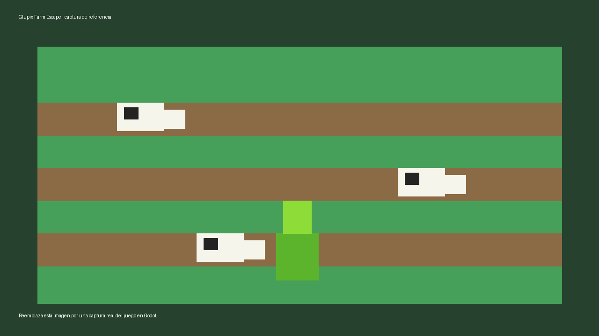

# GLUPIX FARM ESCAPE

## Descripción general

**GLUPIX FARM ESCAPE** es un juego estilo voxel inspirado en Crossy Road. El jugador controla a **Glupix**, un alien verde que se estrelló en una granja mientras intentaba llevarse unas vacas. Ahora debe escapar por un camino infinito lleno de vacas, pollos, obstáculos y artefactos espaciales perdidos.

## Personaje principal

**Glupix** es un alien caricaturesco de estilo voxel. Durante el accidente perdió varios objetos de su nave, por lo que mientras escapa debe recuperar artefactos alienígenas repartidos por el corral.

## Controles

- **W / Flecha arriba:** mirar hacia adelante.
- **A / Flecha izquierda:** mirar a la izquierda.
- **S / Flecha abajo:** mirar hacia atrás.
- **D / Flecha derecha:** mirar a la derecha.
- **Espacio:** avanzar en la dirección en la que Glupix está mirando.
- **ESC / P:** abrir o cerrar el menú de pausa.

## NPCs y comportamiento

### Vacas

Las vacas se mueven horizontalmente por los carriles del corral. Su velocidad puede variar conforme avanza la partida y también puede modificarse temporalmente por la API externa. Si una vaca toca a Glupix, aparece la pantalla de **GAME OVER** con el tiempo y score obtenido.

### Pollos

Los pollos aparecen como una manada rápida estilo tren de Crossy Road. Antes de cruzar reproducen una alerta sonora. Si Glupix queda en su carril cuando pasan, también provocan **GAME OVER**.

## Coleccionables espaciales

Glupix puede recoger artefactos que perdió al estrellarse:

- **Mini OVNI:** suma 100 puntos.
- **Planeta Tierra:** suma 250 puntos.
- **Mini alien:** suma 150 puntos.
- **Cristal espacial:** suma 200 puntos.
- **Núcleo de energía:** suma 300 puntos.

Al recoger un coleccionable, el contador **Artefactos** aumenta, se reproduce un sonido, el objeto desaparece y el score recibe puntos extra. El total recolectado se conserva durante la sesión aunque se reinicie el nivel.

## Base de datos local

El juego guarda la mejor puntuación histórica en almacenamiento local dentro de `user://`. Si está instalado el plugin **godot-sqlite**, se usa SQLite con la tabla `highscores` y los campos:

- `id`
- `player_name`
- `max_score`
- `date`

Si el plugin no está disponible, el juego usa un archivo local fallback para mantener funcionando el high score. En pantalla se muestra la mejor puntuación guardada.

## API externa

Se utiliza **Advice Slip API** (`https://api.adviceslip.com/advice`).  
El juego consulta la API al recoger un artefacto alienígena. La respuesta se procesa internamente y activa un evento temporal:

- **Tormenta espacial:** las vacas se vuelven más rápidas por 8 segundos.
- **Campo gravitacional:** las vacas se vuelven más lentas por 8 segundos.

En pantalla ya no se muestra la frase completa de la API; solo se muestra el evento y su efecto para que el HUD sea más limpio.


## Captura de pantalla




## Obstáculos

Los objetos de granja como pacas de heno, cajas, bebederos, árboles y costales bloquean el movimiento del jugador. Glupix no puede avanzar hacia una casilla ocupada por estos objetos.


## Cambios de la práctica 8

### Coleccionables cada 500 puntos

Los artefactos alienígenas aparecen de forma más rara: cada **3000 puntos** y con máximo **un artefacto activo** en el mapa. Esto permite que el camino infinito siga teniendo objetivos secundarios mientras Glupix avanza.

### Eventos externos

La API externa se consulta automáticamente cada **30 segundos** durante la partida. En lugar de mostrar el texto técnico de la API, el HUD muestra un evento del mundo del juego, por ejemplo:

- **Campo gravitacional:** vacas más lentas.
- **Tormenta espacial:** vacas más rápidas.
- **Pulso de energía:** bonus de score.
- **Radar alienígena:** aparece un artefacto extra.
- **Estela cósmica:** bonus y ajuste temporal de velocidad.

### Game Over

Al perder, aparece una pantalla de **GAME OVER** con icono de advertencia y consejos que cambian automáticamente cada pocos segundos.


## Base de Datos Local SQLite

El juego utiliza una base de datos local SQLite para guardar la mejor puntuación histórica.

La base de datos se crea en:

```txt
user://game_data.db
```

La tabla utilizada se llama `highscores` y contiene los campos solicitados:

```sql
CREATE TABLE IF NOT EXISTS highscores (
    id INTEGER PRIMARY KEY,
    player_name TEXT DEFAULT 'Jugador',
    max_score INTEGER,
    date TEXT
);
```

Cuando termina la partida por colisión con una vaca o una manada de pollos, el juego compara el score actual con la mejor puntuación guardada. Si el score actual es mayor, se actualiza el registro principal con `id = 1`.

En pantalla se muestra la mejor puntuación histórica mediante el texto:

```txt
Mejor: <puntuación>
```

### Configuración técnica

Para que SQLite funcione en Godot, se debe instalar y habilitar el plugin **godot-sqlite** desde la Asset Library. El script encargado de manejar la base de datos es:

```txt
res://scripts/highscore_manager.gd
```


## Panel de Scores en HUD

El HUD incluye un botón con icono de estrella **★**. Al hacer clic se abre un panel con:

- **Máximo histórico** guardado.
- **Últimos 10 scores** registrados.

Los datos se toman de la tabla SQLite `highscores`.

## SQLite: últimos 10 y máximo

La tabla `highscores` guarda cada partida finalizada con:

```sql
id INTEGER PRIMARY KEY
player_name TEXT DEFAULT 'Jugador'
max_score INTEGER
date TEXT
```

Al terminar una partida, el score se inserta en la tabla. El juego conserva los últimos 10 registros y también conserva el score máximo histórico, aunque sea más antiguo.


## Ajuste de rareza de artefactos y eventos

Los artefactos ahora aparecen menos: máximo uno activo y cada 3000 puntos. Los tipos se alternan para evitar repeticiones seguidas. Los eventos espaciales ya no dependen de recoger artefactos; se activan cada 30 segundos.
